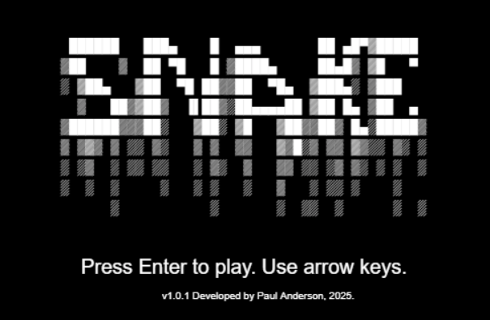

# Snake Game

Welcome to a nostalgic throwback version of Snake, created by Paul Anderson. This game was a fun and quick project developed for a team-building exercise, where each of us had just 2-3 hours to create something entertaining. I hope you enjoy the ASCII art.

## Table of Contents

- [Getting Started](#getting-started)
- [Gameplay](#gameplay)
- [Contributing](#contributing)
- [License](#license)
- [Author Notes](#author-notes)

## Screenshot

## Getting Started

To get started with this game, you simply need a modern web browser that supports JavaScript and HTML5.

### Prerequisites

- A modern web browser like Chrome, Firefox, or Safari.

### Running the Game

1. Download the game files from this repository.
2. Open the `index.html` file in your browser to start the game.
3. Use the arrow keys to start playing and enjoy!

## Gameplay

- **Start the Game**: Press 'Enter' to start the game.
- **Navigate**: Use the arrow keys (←, ↑, →, ↓) to direct the snake around the canvas.
- **Objective**: Eat apples that appear randomly on the screen to increase your score and the length of the snake.
- **End Game**: The game ends if the snake collides with itself or the boundaries of the game area.

## Contributing

Contributions to this Snake Game are welcome! Please feel free to fork this repository, make changes, and submit pull requests. You can also open issues if you run into bugs or have feature suggestions.

## License

This project is open-sourced under the MIT license. 

## Author Notes

This game was created by Paul Anderson. Due to the security requirements of my current position, my other repositories have been made private. I appreciate your understanding regarding this matter.

For more fun projects and professional updates, visit [my website](https://www.asyncfunction.com).

Thank you for visiting, and I hope you enjoy playing the game as much as I enjoyed making it!